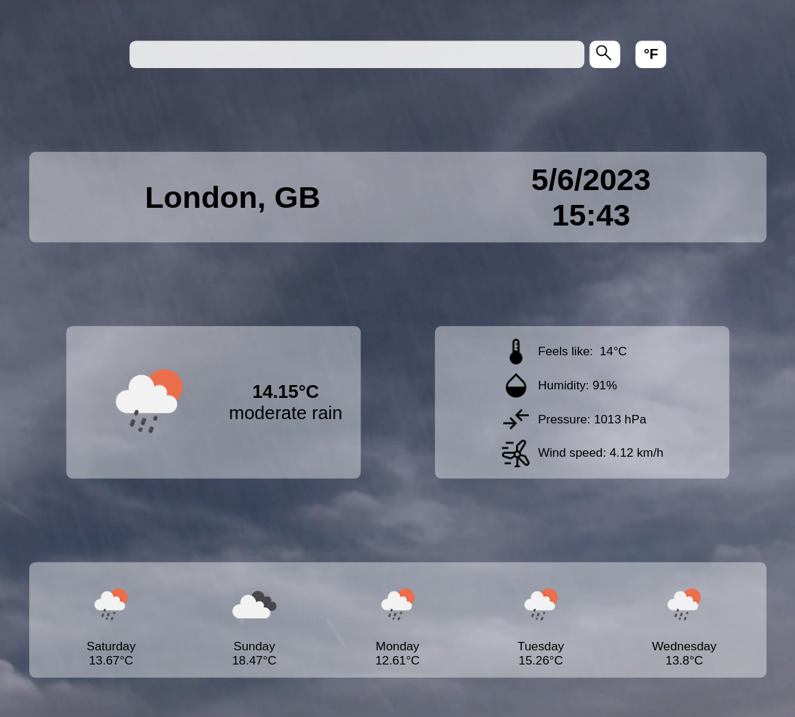
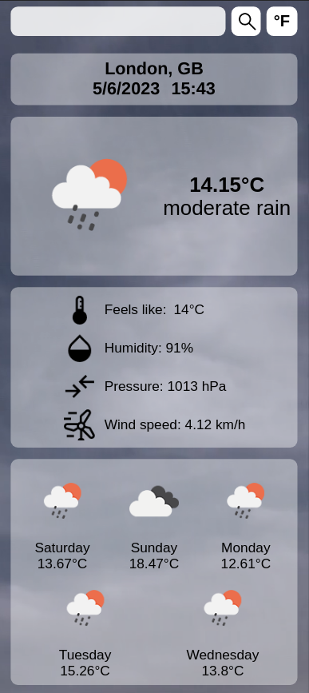

# Odin Project #12: Weather App

The goal of this Odin Project assignment was to create a weather forecast site using the OpenWeatherMap API.

I started and finished this project in February 2023.

## Assignment

[The Odin Project - JavaScript - #12 Weather App](https://www.theodinproject.com/lessons/node-path-javascript-weather-app)

## Technology

- HTML
- CSS
- Vanilla JavaScript
- Webpack

## Key Concepts

- API
- Promises
- Asynchronous functions: fetch and async/await
- try/catch error handling

## Features

- Current weather and temperature
- Additional data such as humidity
- Search cities worldwide
- Forecast for the next few days
- Switch between imperial and metric
- Display an error message if a city wasn't found
- Different icons and background videos for each weather type

## Links

[Live Demo](https://bn7631-odin-weather-app.pages.dev)

## Screenshots

### Desktop



### Mobile



## Sources

- https://www.pexels.com/video/blue-sky-video-855005/
- https://www.pexels.com/video/fair-weather-day-854002/
- https://www.pexels.com/video/cumulus-clouds-formation-in-the-sky-3129769/
- https://www.pexels.com/video/rainy-weather-856186/
- https://www.pexels.com/video/thunderstorm-856429/
- https://www.pexels.com/video/video-of-snowfall-855614/
- https://www.pexels.com/video/a-foggy-landscape-1911457/

## Deployment

```bash
# clone repo
git clone https://github.com/BrightNeon7631/odin-weather-app.git

# install project dependencies
npm install

# run webpack dev server
npm start

# create a production build
npm run build

```